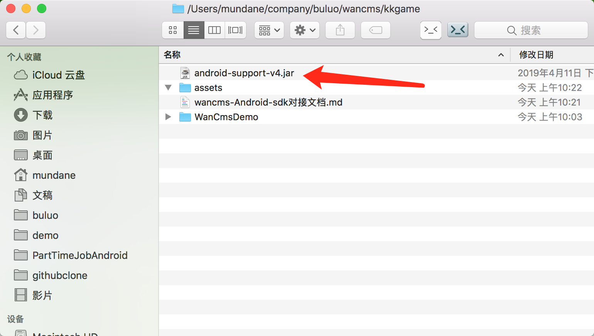
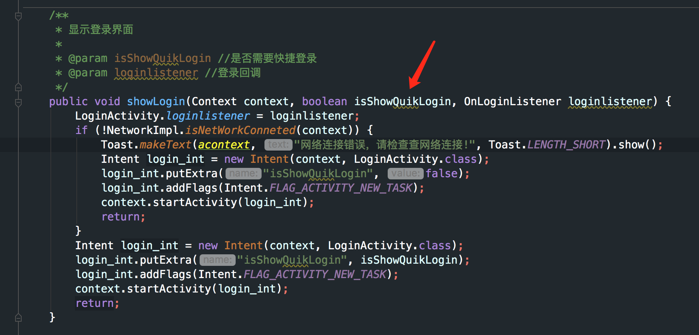
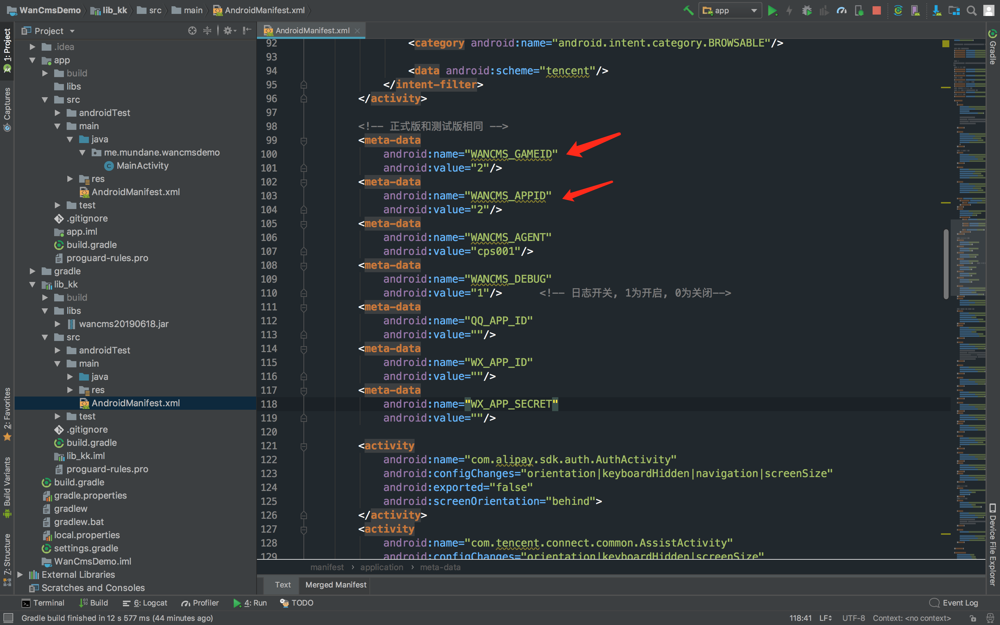

### step1:导入
在Android Studio中File -> New -> Import Module, 导入WanCmsDemo中的module lib_kk
然后在主工程中依赖该module

``` groovy
implementation project(':lib_kk')
```
或者自行复制lib_kk中的jar包、资源文件、AndroidManifest.xml文件等, 不可缺少

### step2:在代码中使用
#### 创建WancmsSDkManager实例

``` java
mWancmsSDKManager = WancmsSDKManager.getInstance(this);
mWancmsSDKManager.setActivity(this);
```
#### 弹出登录界面:

``` java

        /**
         * 显示登录界面
         *
         * @param isShowQuikLogin 是否需要快捷登录
         * @param loginlistener 登录回调
         */
        mWancmsSDKManager.showLogin(this, true, new OnLoginListener() {
            @Override
            public void loginSuccess(LogincallBack logincallback) {
                // 登录成功
                Toast.makeText(getApplication(), "登录成功\n" + " username:" + logincallback.username, Toast.LENGTH_LONG).show();
                // 传入登出的监听回调
                mWancmsSDKManager.showFloatView(mLogoutListener);
            }
        
            @Override
            public void loginError(LoginErrorMsg errorMsg) {
                Toast.makeText(getApplication(), errorMsg.msg, Toast.LENGTH_LONG).show();
            }
        });
```
#### 充值(支付):

``` java

        /**
          * 显示充值
          *
          * @param roleid 角色id
          * @param money 充值金额
          * @param productname 游戏名称 例如诛仙-3阶成品天琊
          * @param productdesc 产品描述
          * @param attach 拓展参数(若有自定义参数传入)
          * @param onPaymentListener 充值回调监听
          **/
        mWancmsSDKManager.showPay(this, "caobawang158", money, "1", "杀人书", "金币", "", new OnPaymentListener() {
            @Override
            public void paymentSuccess(PaymentCallbackInfo callbackInfo) {
                Toast.makeText(getApplication(), "充值金额数" + callbackInfo.money + " 消息提示：" + callbackInfo.msg, Toast.LENGTH_LONG).show();
            }
        
            @Override
            public void paymentError(PaymentErrorMsg errorMsg) {
                Toast.makeText(getApplication(), "充值失败：code:" + errorMsg.code + "  ErrorMsg:" + errorMsg.msg + "  预充值的金额：" + errorMsg.money, Toast.LENGTH_LONG).show();
            }
        });
```

#### 设置角色信息:


``` java
    /**
     * 设置游戏基本角色
     *
     * @param roleId 角色id
     * @param roleName 角色名称
     * @param roleLevel 角色等级
     * @param serverId 服务器id
     * @param serverName 服务器名称
     */
        try {
            JSONObject json = new JSONObject();
            json.put("time", "20170417");
            mWancmsSDKManager.setRoleDate(this, "caobawang11", "草霸王", "100", "1", "wancms", json);
        } catch (JSONException e) {
            e.printStackTrace();
        }
```
#### 退出登录的回调监听:
``` java
    private OnLogoutListener mLogoutListener = new OnLogoutListener() {
        @Override
        public void logoutSuccess(LogoutcallBack logoutncallback) {
            Toast.makeText(getApplication(), "用户" + logoutncallback.username + "退出登录", Toast.LENGTH_LONG).show();
            // TODO: 在这里做一些退出登录的事情
        }
        
        @Override
        public void logoutError(LogoutErrorMsg errorMsg) {
        }
    };
```

#### 退出登录

``` java
mWancmsSDKManager.recycle();
```
#### 显示悬浮窗

``` java
mWancmsSDKManager.showFloatView(onlogoutlistener);
```

#### 移除悬浮窗
``` java
mWancmsSDKManager.removeFloatView();
```

### 注意事项
1. 若游戏项目中没有v4包或者v7包(可能产生报错或者调用显示登录界面没反应), 可加入android-support-v4.jar(在sdk文件夹的根目录有提供)
   

2. 如果需要自动登录(已经登录过一次后sdk会记住用户名和密码, 调用了showLogin方法后会自动登录)或者不自动登录, 请设置该方法中的第二个参数为true或者false

   

3. 为了解决给完悬浮窗权限要重新进入才能显示悬浮窗的问题, 请务必加入以下代码

   ``` java
       @Override
       protected void onResume() {
           mWancmsSDKManager.setActivity(this);
           mWancmsSDKManager.showFloatView(mLogoutListener);
           super.onResume();
       }
   ```

4. 为了解决退出app了悬浮窗还一直显示的问题, 请务必加入以下代码

   ``` java
      @Override
       protected void onStop() {
           mWancmsSDKManager.removeFloatView();
           super.onStop();
       }
   ```

5. 游戏包的签名方式请务必使用v1的方式签名, 否则我们渠道这边无法生成渠道包

      [Andriod Studio 两种签名机制 V1 和 V2 的区别]([https://blog.csdn.net/Zachary_46/article/details/80049262](https://blog.csdn.net/Zachary_46/article/details/80049262))

      如果不知道游戏包的签名方式是v1还是v2, 可以使用我放在sdk文件夹根目录的文件apksigner进行验证

      [查看 apk 文件的签名类型（V1、V2）]([https://blog.csdn.net/feng88724/article/details/85292526](https://blog.csdn.net/feng88724/article/details/85292526))

6. 修改gameid, appid之类的是在AndroidManifest.xml这里

      

7. 线下版本调试完成确认无问题无bug之后, 请联系我们这边的开发打一个线上版本的jar包, 替换原来的wancms.jar之后, 这样打出来的游戏包, 调用登录、支付等接口就是线上版本了

